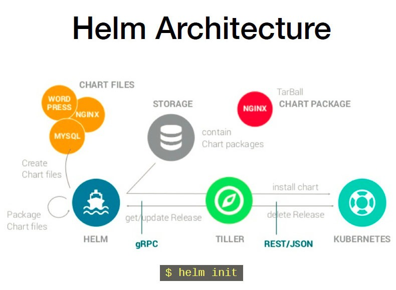

# Helm

Kubernetes를 위한 Package Manager인 Helm의 개념 파악 및 실습을 통한 연구 [](https://docs.helm.sh/)

## Architecture [](https://programmer.help/blogs/helm-for-k8s-quick-download-yaml-file-template.html)

- helm이란 k8s를 package로 관리해 주는 툴로 일종의 Python에서 package를 관리하는 pip 또는 Node.js에서의 npm 역할과 유사 개념
- `helm chart`는 helm의 package format으로 k8s를 설명하는 파일들의 집합
	- Chart.yaml : 해당 helm chart에 대한 정보 포함
	- values.yaml : 해당 helm chart에서 사용하는 가종 값들에 대한 정의
	- chart directory : 의존하는 chart에 대한 정보
	- template : k8s를 정의하는 menifest file이 정의되어 있는 folder
	- README.md : 사용자가 읽을 수 있는 README file
- repository : chart들이 공유되는 공간으로 일종의 docker hub와 같은 개념
- release : k8s 환경에서 동작되는 서비들의 release version



### Prerequisites

- A Kubernetes cluster 생성
- 설치에 적용할 보안 구성 결정 (있는 경우)
- Installing and configuring Helm

※ 본 실습에서는 GKE를 사용하여 설치 및 실습을 진행합니다.
※ GKE에 대한 자세한 설명은 저의 또 다른 게시물을 참고하세요 (https://github.com/mincloud1501/MSA_miniProject)

### Initialize a Helm Chart Repository

```bash
mincloud1501@cloudshell:~ (zipkin-proxy)$ helm repo add stable https://kubernetes-charts.storage.googleapis.com/
"stable" has been added to your repositories

mincloud1501@cloudshell:~ (zipkin-proxy)$ helm search repo stable
NAME                                    CHART VERSION   APP VERSION             DESCRIPTION
stable/acs-engine-autoscaler            2.2.2           2.1.1                   DEPRECATED Scales worker nodes within agent pools
stable/aerospike                        0.3.2           v4.5.0.5                A Helm chart for Aerospike in Kubernetes
stable/airflow                          7.3.0           1.10.10                 Airflow is a platform to programmatically autho...
stable/ambassador                       5.3.2           0.86.1                  DEPRECATED A Helm chart for Datawire Ambassador
stable/anchore-engine                   1.6.9           0.7.2                   Anchore container analysis and policy evaluatio...
stable/apm-server                       2.1.5           7.0.0                   The server receives data from the Elastic APM a...
stable/ark                              4.2.2           0.10.2                  DEPRECATED A Helm chart for ark
stable/artifactory                      7.3.1           6.1.0                   DEPRECATED Universal Repository Manager support...
stable/artifactory-ha                   0.4.1           6.2.0                   DEPRECATED Universal Repository Manager support...
stable/atlantis                         3.12.2          v0.14.0                 A Helm chart for Atlantis https://www.runatlant...
# ... and many more

```

### Install an Example Chart

- helm을 이용하여 mysql을 k8s환경에서 동작되도록 만들어 보는 예제를 진행해 본다.

```bash
mincloud1501@cloudshell:~ (zipkin-proxy)$ helm repo update
Hang tight while we grab the latest from your chart repositories...
...Successfully got an update from the "stable" chart repository
Update Complete. ⎈ Happy Helming!⎈

mincloud1501@cloudshell:~ (zipkin-proxy)$ helm install stable/mysql --generate-name
NAME: mysql-1595924649
LAST DEPLOYED: Tue Jul 28 08:24:16 2020
NAMESPACE: default
STATUS: deployed
REVISION: 1
NOTES:
MySQL can be accessed via port 3306 on the following DNS name from within your cluster:
mysql-1595924649.default.svc.cluster.local

mincloud1501@cloudshell:~ (zipkin-proxy)$ helm ls
NAME                    NAMESPACE       REVISION        UPDATED                                 STATUS          CHART           APP VERSION
mysql-1595924649        default         1               2020-07-28 08:24:16.120852005 +0000 UTC deployed        mysql-1.6.6     5.7.30

mincloud1501@cloudshell:~ (zipkin-proxy)$ kubectl get pod --all-namespaces
NAMESPACE      NAME                                                        READY   STATUS      RESTARTS   AGE
default        mysql-1595924649-6d9c8f6c78-tjs6l                           1/1     Running     0          4m5s

mincloud1501@cloudshell:~ (zipkin-proxy)$ kubectl get svc
NAME                 TYPE           CLUSTER-IP    EXTERNAL-IP   PORT(S)        AGE
mysql-1595924649     ClusterIP      10.8.15.185   <none>        3306/TCP       5m23s
```