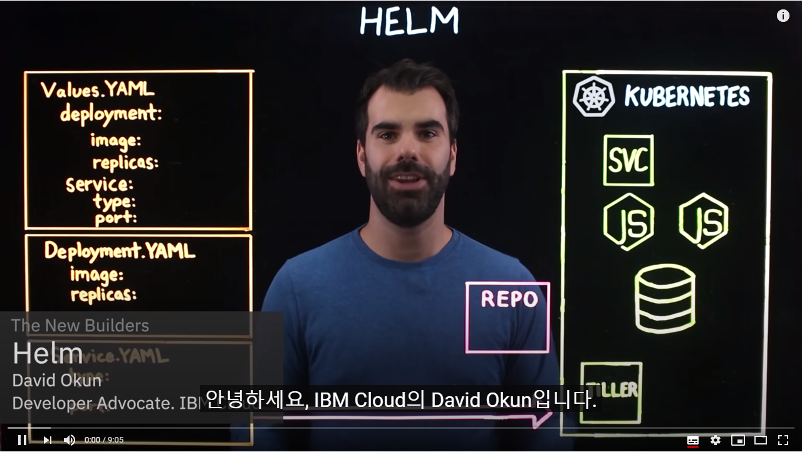
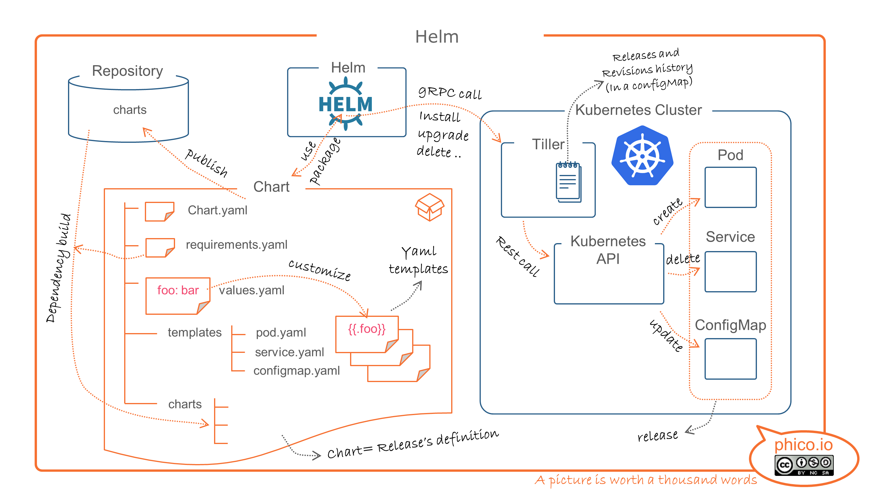
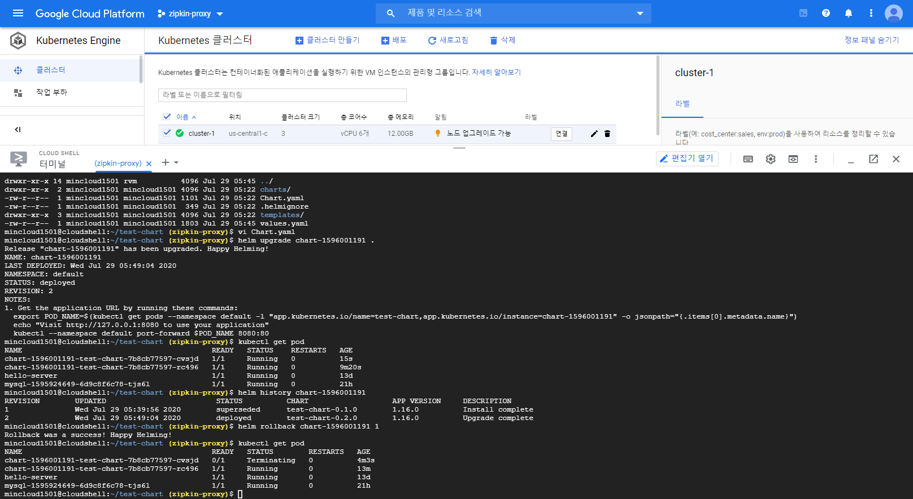
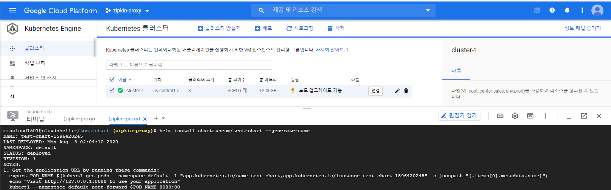

# Helm

Kubernetes를 위한 Package Manager인 Helm의 개념 파악 및 실습을 통한 연구 [](https://docs.helm.sh/)

[](https://www.youtube.com/watch?v=fy8SHvNZGeE)

### Architecture [](http://phico.io/post/helm/)

- Helm이란 k8s를 package로 관리해 주는 툴로 일종의 Python에서 package를 관리하는 pip 또는 Node.js에서의 npm 역할과 유사 개념
	- `helm chart`는 helm의 package format으로 k8s를 설명하는 파일들의 집합
	- repository : chart들이 공유되는 공간으로 일종의 docker hub와 같은 개념
	- release : k8s 환경에서 동작되는 서비들의 release version
- Helm은 k8s를 사용할때, 같이 많이 사용되는 solution이고 특히 k8s에 application 설정 및 배포 관점에서 매우 유용하다. 물론 전체 CI/CD pipeline을 모두 만들 수는 없지만, Spinnaker나 Jenkins X 등의 tool과 함께 전체 CI/CD pipeline의 중요한 요소로서 사용된다.



### Prerequisites

- A Kubernetes cluster 생성
- 설치에 적용할 보안 구성 결정 (있는 경우)
- Installing and configuring Helm

※ 본 실습에서는 GKE를 사용하여 설치 및 실습을 진행합니다.

※ GKE에 대한 자세한 설명은 저의 또 다른 게시물을 참고하세요 (https://github.com/mincloud1501/MSA_miniProject)

※ 이번 실습에서 알아볼 명령 셋은 아래와 같습니다. 우선 기존 생성되어 있는 chart를 repository에서 가져와 설치/업그레이드/배포해 봅니다.

```bash
-----------------------------------------------------------------------------------
repository                      | chart
-----------------------------------------------------------------------------------
helm repo list                  | helm search [repo/hub] <keyword>
helm repo add <repo name> <url> | helm inspect [chart/values/README] <chart>
helm repo remove <name>         | helm install [-f <config path>] <chart>
helm repo update                | helm ls
-                               | helm status <release name>
-                               | helm get [values/manifest] <release name>
-                               | helm upgrade [-f <config path>] <release> <chart>
-                               | helm history <release>
-                               | helm rollback <release> <revision no>
-                               | helm delete <release name> [--purge]
------------------------------------------------------------------------------------
```

### Initialize a Helm Chart Repository

- helm chart repository 목록을 확인하고 새로운 repository를 등록한다. Google helm chart를 가장 많이 사용한다. (https://github.com/helm/charts)
- stable repository는 helm 설치 시 기본으로 등록된다.

```bash
mincloud1501@cloudshell:~ (zipkin-proxy)$ helm repo add stable https://kubernetes-charts.storage.googleapis.com/
"stable" has been added to your repositories

mincloud1501@cloudshell:~ (zipkin-proxy)$ helm search repo stable
NAME                                    CHART VERSION   APP VERSION             DESCRIPTION
stable/acs-engine-autoscaler            2.2.2           2.1.1                   DEPRECATED Scales worker nodes within agent pools
stable/aerospike                        0.3.2           v4.5.0.5                A Helm chart for Aerospike in Kubernetes
stable/airflow                          7.3.0           1.10.10                 Airflow is a platform to programmatically autho...
stable/ambassador                       5.3.2           0.86.1                  DEPRECATED A Helm chart for Datawire Ambassador
stable/anchore-engine                   1.6.9           0.7.2                   Anchore container analysis and policy evaluatio...
stable/apm-server                       2.1.5           7.0.0                   The server receives data from the Elastic APM a...
stable/ark                              4.2.2           0.10.2                  DEPRECATED A Helm chart for ark
stable/artifactory                      7.3.1           6.1.0                   DEPRECATED Universal Repository Manager support...
stable/artifactory-ha                   0.4.1           6.2.0                   DEPRECATED Universal Repository Manager support...
stable/atlantis                         3.12.2          v0.14.0                 A Helm chart for Atlantis https://www.runatlant...
# ... and many more

mincloud1501@cloudshell:~ (zipkin-proxy)$ helm repo list
NAME    URL
stable  https://kubernetes-charts.storage.googleapis.com/
```

### Install an Example Chart

- helm을 이용하여 mysql을 k8s환경에서 동작되도록 만들어 보는 예제를 진행해 본다.

```bash
mincloud1501@cloudshell:~ (zipkin-proxy)$ helm repo update
Hang tight while we grab the latest from your chart repositories...
...Successfully got an update from the "stable" chart repository
Update Complete. ⎈ Happy Helming!⎈

mincloud1501@cloudshell:~ (zipkin-proxy)$ helm install stable/mysql --generate-name
NAME: mysql-1595924649
LAST DEPLOYED: Tue Jul 28 08:24:16 2020
NAMESPACE: default
STATUS: deployed
REVISION: 1
NOTES:
MySQL can be accessed via port 3306 on the following DNS name from within your cluster:
mysql-1595924649.default.svc.cluster.local

To get your root password run:
    MYSQL_ROOT_PASSWORD=$(kubectl get secret --namespace default mysql-1595924649 -o jsonpath="{.data.mysql-root-password}" | base64 --decode; echo)
To connect to your database:
1. Run an Ubuntu pod that you can use as a client:
    kubectl run -i --tty ubuntu --image=ubuntu:16.04 --restart=Never -- bash -il
2. Install the mysql client:
    $ apt-get update && apt-get install mysql-client -y
3. Connect using the mysql cli, then provide your password:
    $ mysql -h mysql-1595924649 -p
To connect to your database directly from outside the K8s cluster:
    MYSQL_HOST=127.0.0.1
    MYSQL_PORT=3306
    # Execute the following command to route the connection:
    kubectl port-forward svc/mysql-1595924649 7000:3306
    mysql -h ${MYSQL_HOST} -P${MYSQL_PORT} -u root -p${MYSQL_ROOT_PASSWORD}

mincloud1501@cloudshell:~ (zipkin-proxy)$ helm ls
NAME                    NAMESPACE       REVISION        UPDATED                                 STATUS          CHART           APP VERSION
mysql-1595924649        default         1               2020-07-28 08:24:16.120852005 +0000 UTC deployed        mysql-1.6.6     5.7.30

# Helm으로 배포된 application의 Pod를 k8s에서 확인할 수 있다.
mincloud1501@cloudshell:~ (zipkin-proxy)$ kubectl get pod --all-namespaces
NAMESPACE      NAME                                                        READY   STATUS      RESTARTS   AGE
default        mysql-1595924649-6d9c8f6c78-tjs6l                           1/1     Running     0          4m5s

mincloud1501@cloudshell:~ (zipkin-proxy)$ kubectl get svc
NAME                 TYPE           CLUSTER-IP    EXTERNAL-IP   PORT(S)        AGE
mysql-1595924649     ClusterIP      10.8.15.185   <none>        3306/TCP       5m23s
```

- helm으로 설치한 k8s mysql에 접속하려면, root pwd를 받아와야 한다.

```bash
mincloud1501@cloudshell:~ (zipkin-proxy)$ MYSQL_ROOT_PASSWORD=$(kubectl get secret --namespace default mysql-1595924649 -o jsonpath="{.data.mysql-root-password}" | base64 --decode; echo)

mincloud1501@cloudshell:~ (zipkin-proxy)$ echo $MYSQL_ROOT_PASSWORD
oj1WhOy4qo
```

- k8s mysql에 접속하기 위해 port-forwarding을 해줘야 한다. Local PC의 7000번 port를 3006 port로 포워딩 후, mysql에 접속한다.

```bash
mincloud1501@cloudshell:~ (zipkin-proxy)$ kubectl port-forward svc/mysql-1595924649 7000:3306
Forwarding from 127.0.0.1:7000 -> 3306

mincloud1501@cloudshell:~ (zipkin-proxy)$ mysql -h 127.0.0.1 -P 7000 -u root -p
Enter password:
Welcome to the MySQL monitor.  Commands end with ; or \g.
Your MySQL connection id is 303
Server version: 5.7.30 MySQL Community Server (GPL)

Copyright (c) 2000, 2020, Oracle and/or its affiliates. All rights reserved.

Oracle is a registered trademark of Oracle Corporation and/or its
affiliates. Other names may be trademarks of their respective
owners.

Type 'help;' or '\h' for help. Type '\c' to clear the current input statement.

mysql> quit
```

- 위와 같이 mysql에 접속하면, 이전 터미널에서 connection 정보를 확인할 수 있다.

```bash
mincloud1501@cloudshell:~ (zipkin-proxy)$ kubectl port-forward svc/mysql-1595924649 7000:3306
Forwarding from 127.0.0.1:7000 -> 3306

Handling connection for 7000
```

### Uninstall a Release

```bash
mincloud1501@cloudshell:~ (zipkin-proxy)$ helm uninstall mysql-1595924649
release "mysql-1595924649" uninstalled

mincloud1501@cloudshell:~ (zipkin-proxy)$ helm status mysql-1595924649
Status: UNINSTALLED
```

---

## Create Helm Chart

- 이번 실습에서는 직접 helm chart를 생성하여 repository에 배포하는 방법에 대해 알아본다.

※ chart에 대한 상세 Docs는 https://docs.helm.sh/docs/topics/charts/ 를 참조한다.

```bash
----------------------------------------------------------------------------
create >> test >> packaging
----------------------------------------------------------------------------
helm create <chart name>

helm lint <chart.yaml directory>
helm template <chart.yaml directory>
helm install <chart.yaml directory> --name <release name> --debug --dry-run

helm package <chart.yaml directory>
----------------------------------------------------------------------------
```

#### [Step.1] helm create

- `charts/` : 해당 directory에 종속성을 가지고 있는 helm chart를 저장한다. 만약 웹서비스를 실행하는 helm chart에서 설치 시 mysql helm chart가 필요하면 별도의 dependency 설정을 진행하고, 해당 directory의 helm chart를 호출하게 된다.
- `templates/` : 실제 배포에 필요한 yaml 파일이 저장. 각 yaml 파일은 template화되어 지정한 변수에 따라서 release를 생성할 수 있도록 재사용성을 제공한다.
- `deployment.yaml` : k8s deployment 형태로 배포되기 위해 사용되는 yaml 파일.
- `ingress.yaml` : k8s ingress 형태로 배포되기 위해 사용되는 yaml 파일.
- `service.yaml` : k8s service 형태로 배포되기 위해 사용되는 yaml 파일.
- `NOTES.txt` : 배포 후 사용자에게 제공되는 사용법이나, 구조 등이 설명되어 있는 txt파일.
- `values.yaml` : template화 되어 있는 chart의 변수(dafault)를 정의한다.
- `Chart.yaml` : Chart에 대한 정보가 포함되어 있는 yaml 파일.
- `README.md`

```bash
mincloud1501@cloudshell:~ (zipkin-proxy)$ helm create test-chart
Creating test-chart

mincloud1501@cloudshell:~ (zipkin-proxy)$ tree test-chart
test-chart
├── charts
├── Chart.yaml
├── templates
│   ├── deployment.yaml
│   ├── _helpers.tpl
│   ├── hpa.yaml
│   ├── ingress.yaml
│   ├── NOTES.txt
│   ├── serviceaccount.yaml
│   ├── service.yaml
│   └── tests
│       └── test-connection.yaml
└── values.yaml
3 directories, 10 files
```

#### [Step.2] Install helm chart

- 생성한 Chart를 test-chart-release 명으로 설치하고, 배포된 release 정보를 확인한다.

```bash
mincloud1501@cloudshell:~/test-chart (zipkin-proxy)$ helm install . --generate-name
NAME: chart-1596001191
LAST DEPLOYED: Wed Jul 29 05:39:56 2020
NAMESPACE: default
STATUS: deployed
REVISION: 1
NOTES:
1. Get the application URL by running these commands:
  export POD_NAME=$(kubectl get pods --namespace default -l "app.kubernetes.io/name=test-chart,app.kubernetes.io/instance=chart-1596001191" -o jsonpath="{.items[0].metadata.name}")
  echo "Visit http://127.0.0.1:8080 to use your application"
  kubectl --namespace default port-forward $POD_NAME 8080:80

mincloud1501@cloudshell:~/test-chart (zipkin-proxy)$ helm ls
NAME                    NAMESPACE       REVISION        UPDATED                                 STATUS          CHART                   APP VERSION
chart-1596001191        default         1               2020-07-29 05:39:56.426717706 +0000 UTC deployed        test-chart-0.1.0        1.16.0  
```

#### [Step.3] Helm Upgrad / RollOut

- 배포된 Release의 변경사항이 있거나, 문제가 생긴 version에 대하여 이전 version 또는 지정한 version으로 돌릴 수 있다.
- 기본적으로 배포된 pod는 1개로 values.yaml에서 replicaCount가 1로 정의되어 있기 때문에 1개의 Pod를 확인할 수 있다.

```bash
mincloud1501@cloudshell:~/test-chart (zipkin-proxy)$ kubectl get pod
NAME                                           READY   STATUS    RESTARTS   AGE
chart-1596001191-test-chart-7b8cb77597-rc496   1/1     Running   0          3m53s
```

[values.yaml]

```bash
replicaCount: 2
```

[Chart.yaml]

```bash
version: 0.2.0
```

- replicaCount를 2로, chart의 version을 0.2.0으로 수정한 후, 변경한 chart로 upgrade시 2개의 Pod가 실행된다.

```bash
mincloud1501@cloudshell:~/test-chart (zipkin-proxy)$ helm upgrade chart-1596001191 .
Release "chart-1596001191" has been upgraded. Happy Helming!
NAME: chart-1596001191
LAST DEPLOYED: Wed Jul 29 05:49:04 2020
NAMESPACE: default
STATUS: deployed
REVISION: 2  # <== 2개로 변경되었음을 확인할 수 있다.
NOTES:
1. Get the application URL by running these commands:
  export POD_NAME=$(kubectl get pods --namespace default -l "app.kubernetes.io/name=test-chart,app.kubernetes.io/instance=chart-1596001191" -o jsonpath="{.items[0].metadata.name}")
  echo "Visit http://127.0.0.1:8080 to use your application"
  kubectl --namespace default port-forward $POD_NAME 8080:80

# Chart의 version과 Revision이 증가된 것을 확인할 수 있다.
mincloud1501@cloudshell:~/test-chart (zipkin-proxy)$ kubectl get pod
NAME                                           READY   STATUS    RESTARTS   AGE
chart-1596001191-test-chart-7b8cb77597-cvsjd   1/1     Running   0          15s
chart-1596001191-test-chart-7b8cb77597-rc496   1/1     Running   0          9m20s

# 이전 Revision 번호에 따른 정보를 확인할 수 있다.
mincloud1501@cloudshell:~/test-chart (zipkin-proxy)$ helm history chart-1596001191
REVISION        UPDATED                         STATUS          CHART                   APP VERSION     DESCRIPTION
1               Wed Jul 29 05:39:56 2020        superseded      test-chart-0.1.0        1.16.0          Install complete
2               Wed Jul 29 05:49:04 2020        deployed        test-chart-0.2.0        1.16.0          Upgrade complete

# 새로 배포된 Release에 문제가 생겨서 이전 버전으로 되돌아 가려면, rollback 명령을 실행하여 돌아갈 수 있다.
mincloud1501@cloudshell:~/test-chart (zipkin-proxy)$ helm rollback chart-1596001191 1
Rollback was a success! Happy Helming!

mincloud1501@cloudshell:~/test-chart (zipkin-proxy)$ kubectl get pod
NAME                                           READY   STATUS        RESTARTS   AGE
chart-1596001191-test-chart-7b8cb77597-cvsjd   0/1     Terminating   0          4m3s
chart-1596001191-test-chart-7b8cb77597-rc496   1/1     Running       0          13m
```



---

## Chart Customizing (Feature Point)

- helm은 chart를 install하기 전에 chart value값을 변경하여 customizing이 가능하다.
- 작성한 application을 chart로 만들 때 각종 설정값, domain name, cluster마다 변경되는 환경변수 등을 chart 안에 의존성을 만들지 않고, chart 설치시 외부에서 변경 가능하도록 할수 있는 큰 장점이 있다. (반면에 docker image로 만들어서 가져올땐 하나하나 설정을 바꿔줘야 하는 불편함이 있다.)
- `helm inspect values` 명령을 사용하여 chart의 어떤 옵션들이 설정 가능한지 확인한 후, yaml file로 해당 설정들을 override할 수 있다.

```bash
mincloud1501@cloudshell:~ (zipkin-proxy)$ helm inspect values stable/mariadb
# ... and many more
image:
  registry: docker.io
  repository: bitnami/mariadb
  tag: 10.3.22-debian-10-r27
  extraInitContainers: |

  config: |-
    [mysqld]
    skip-name-resolve
    explicit_defaults_for_timestamp
    basedir=/opt/bitnami/mariadb
    plugin_dir=/opt/bitnami/mariadb/plugin
    port=3306
    socket=/opt/bitnami/mariadb/tmp/mysql.sock
    tmpdir=/opt/bitnami/mariadb/tmp
    max_allowed_packet=16M
    bind-address=0.0.0.0
    pid-file=/opt/bitnami/mariadb/tmp/mysqld.pid
    log-error=/opt/bitnami/mariadb/logs/mysqld.log
    character-set-server=UTF8
    collation-server=utf8_general_ci
    initialDelaySeconds: 30

    ## Default Kubernetes values
    periodSeconds: 10
    timeoutSeconds: 1
    successThreshold: 1
    failureThreshold: 3
  # Enable this if you're using https://github.com/coreos/prometheus-operator
  serviceMonitor:
    enabled: false
    selector:
      prometheus: kube-prometheus

tests:
  enabled: true
  # resources: {}
  testFramework:
    image:
      registry: docker.io
      repository: dduportal/bats
      tag: 0.4.0
```

- mincloud로 사용자를 만들고, minclouddb로 database를 만들어서 사용자에게 권한을 부여해 준다.

```bash
mincloud1501@cloudshell:~ (zipkin-proxy)$ echo '{mariadbUser: mincloud, mariadbDatabase: minclouddb}' > config.yaml
```

- 생성한 `config.yaml`로 install 한다.

```bash
mincloud1501@cloudshell:~ (zipkin-proxy)$ helm install -f config.yaml stable/mariadb --generate-name
NAME: mariadb-1596502752
LAST DEPLOYED: Tue Aug  4 00:59:18 2020
NAMESPACE: default
STATUS: deployed
REVISION: 1
# ... and many more

mincloud1501@cloudshell:~ (zipkin-proxy)$ helm ls
NAME                    NAMESPACE       REVISION        UPDATED                                 STATUS          CHART                   APP VERSION
mariadb-1596502752      default         1               2020-08-04 00:59:18.913798745 +0000 UTC deployed        mariadb-7.3.14          10.3.22
```

## Chart Upgrade & Rollback

- chart의 신규 version이 있거나, 이미 release한 chart의 설정값을 변경하고자 할 때는 `helm upgrade` 명령으로 수행 가능하다.
- 

[upgrade.yaml]

```bash
mariadbUser: user1
```

```bash
mincloud1501@cloudshell:~ (zipkin-proxy)$ helm upgrade -f upgrade.yaml mariadb-1596502752 stable/mariadb
Release "mariadb-1596502752" has been upgraded. Happy Helming!
NAME: mariadb-1596502752
LAST DEPLOYED: Tue Aug  4 01:09:16 2020
NAMESPACE: default
STATUS: deployed
REVISION: 2
# ... and many more

mincloud1501@cloudshell:~ (zipkin-proxy)$ helm get values mariadb-1596502752
USER-SUPPLIED VALUES:
mariadbUser: user1
```

- 만약 release가 잘못 되었을 경우 `helm rollback [RELEASE][REVISION]` 명령으로 rollback 가능하다.

```bash
mincloud1501@cloudshell:~ (zipkin-proxy)$ helm rollback mariadb-1596502752 1
Rollback was a success! Happy Helming!

mincloud1501@cloudshell:~ (zipkin-proxy)$ helm get values mariadb-1596502752
USER-SUPPLIED VALUES:
mariadbDatabase: minclouddb
mariadbUser: mincloud
```

---

## Chartmuseum을 이용한 Private Helm Chart Repository [](https://chartmuseum.com)

```bash
ChartMuseum is an open-source Helm Chart Repository written in Go (Golang), with support for cloud storage backends, including Google Cloud Storage, Amazon S3, Microsoft Azure Blob Storage, Alibaba Cloud OSS Storage and Openstack Object Storage.
```

- Chartmusem은 오픈소스 Helm Chart Repository Server로 인증 기능 뿐만 아니라 File Storage로 AWS S3, Google GCS 등을 backend로 사용할 수 있다.
- Chartmuseum은 다양한 Platform에서 제공되는 Helm Chart Repository로 쉽게 설치 조작이 가능하다.
- Docker Container를 이용하여 실행시킬 수 있으며, 기본적으로 8080 port로 Listening 되어 있다.
- Chart가 실제로 저장될 Persistent Volumes Directory로 `/data` directory를 생성하여 사용한다.

#### [Step.0] Installation (https://github.com/helm/chartmuseum)

- File을 download 후 실행권한을 주고 실행경로에 옮긴다.

```bash
# on Linux Manually Installation
mincloud1501@cloudshell:~/test-chart (zipkin-proxy)$ curl -LO https://s3.amazonaws.com/chartmuseum/release/latest/bin/linux/amd64/chartmuseum
mincloud1501@cloudshell:~/test-chart (zipkin-proxy)$ chmod +x ./chartmuseum
mincloud1501@cloudshell:~/test-chart (zipkin-proxy)$ sudo mv ./chartmuseum /usr/local/bin

mincloud1501@cloudshell:~/test-chart (zipkin-proxy)$ chartmuseum --version
ChartMuseum version 0.12.0 (build 101e26a)
```

- chart의 정보는 api를 통하여 확인할 수 있는데, 처음에는 등록한 Chart가 없기때문에 정보를 확인할 수 없다.

```bash
# local에서 chartmuseum을 test해 보기 위해, 한 개의 Shell에서 chartmuseum을 아래와 같이 실행하면 running 상태로 실행된다.
mincloud1501@cloudshell:~ (zipkin-proxy)$ chartmuseum --debug --port=8080 --storage="local" --storage-local-rootdir="./chartstorage"

2020-08-03T01:52:06.089Z        DEBUG   Fetching chart list from storage        {"repo": ""}
2020-08-03T01:52:06.089Z        DEBUG   No change detected between cache and storage    {"repo": ""}
2020-08-03T01:52:06.090Z        INFO    Starting ChartMuseum    {"port": 8080}

# 다른 Shell에서 현재의 chart내 내용을 확인해 보면 추가 등록한 내용이 없기 때문에 공란으로 표기된다.
mincloud1501@cloudshell:~ (zipkin-proxy)$ curl http://localhost:8080/api/charts
{}
```

#### [Step.1] Packaging

- 앞서 생성했던 test-chart으로 파일을 배포하기 위해서는 chart file을 `*.tgz` 파일 형태로 packaging해야 하는데 `helm package [PACKAGE DIRECTORY]`를 사용하여 Packaging한다.

```bash
mincloud1501@cloudshell:~ (zipkin-proxy)$ helm package ./test-chart
Successfully packaged chart and saved it to: /home/mincloud1501/test-chart-0.2.0.tgz
```

- 만약 packaged file에 대한 무결성을 보장하기 위해서 package file에 key로 signing 하는 방법이 있다. `helm package --sign`을 이용해서 signing 한다.
- package에 signing을 하면 `*.prov 파일 (provenance file)`이 생성되고, chart package를 설치할 때 `helm install --verify`을 이용하면 이 provenance 파일을 이용해서 package의 무결성을 확인한 후, 변조되지 않은 경우에만 설치를 진행한다.

- curl을 통해 Packaging 되어 있는 Chart Package를 Chartmuseum에 등록한 후, API를 호출하여 등록된 Chart를 확인해 본다.

```bash
mincloud1501@cloudshell:~/test-chart (zipkin-proxy)$ curl --data-binary "@test-chart-0.2.0.tgz" http://localhost:8080/api/charts
{"saved":true}

# 다시 차트목록을 확인하면 등록한 차트가 나오는걸 확인할 수 있다.
mincloud1501@cloudshell:~/test-chart (zipkin-proxy)$ curl http://localhost:8080/api/charts
{"test-chart":[{"name":"test-chart","version":"0.2.0","description":"A Helm chart for Kubernetes","apiVersion":"v2","appVersion":"1.16.0","type":"application","urls":["charts/test-chart-0.2.0.tgz"],"created":"2020-08-03T01:54:53.237775625Z","digest":"d615fbebaea0a877902bc669df9203a9fabdece62178fa74d461855969cfe108"}]}
```

#### [Step.2] Chartmuseum을 이용한 Chart 설치

- Chartmuseum으로 실행한 Chart Repository를 이용해서 test-chart를 설치하기 위해 `helm repo add` 명령으로 chartmuseum을 새로운 helm repository로 추가해 준다.
- `helm search repo`를 통해서 저장소가 제대로 등록됐는지 확인하고, 이 chart 설치는 `helm install chartmuseum/test-chart` 명령을 통해서 설치할 수 있다.

```bash
mincloud1501@cloudshell:~/test-chart (zipkin-proxy)$ helm repo add chartmuseum http://localhost:8080
"chartmuseum" has been added to your repositories


mincloud1501@cloudshell:~/test-chart (zipkin-proxy)$ helm search repo chartmuseum
NAME                    CHART VERSION   APP VERSION     DESCRIPTION
stable/chartmuseum      2.13.1          0.12.0          Host your own Helm Chart Repository
chartmuseum/test-chart  0.2.0           1.16.0          A Helm chart for Kubernetes


mincloud1501@cloudshell:~/test-chart (zipkin-proxy)$ helm install chartmuseum/test-chart --generate-name
NAME: test-chart-1596420245
LAST DEPLOYED: Mon Aug  3 02:04:10 2020
NAMESPACE: default
STATUS: deployed
REVISION: 1
NOTES:
1. Get the application URL by running these commands:
  export POD_NAME=$(kubectl get pods --namespace default -l "app.kubernetes.io/name=test-chart,app.kubernetes.io/instance=test-chart-1596420245" -o jsonpath="{.items[0].metadata.name}")
  echo "Visit http://127.0.0.1:8080 to use your application"
  kubectl --namespace default port-forward $POD_NAME 8080:80
```

